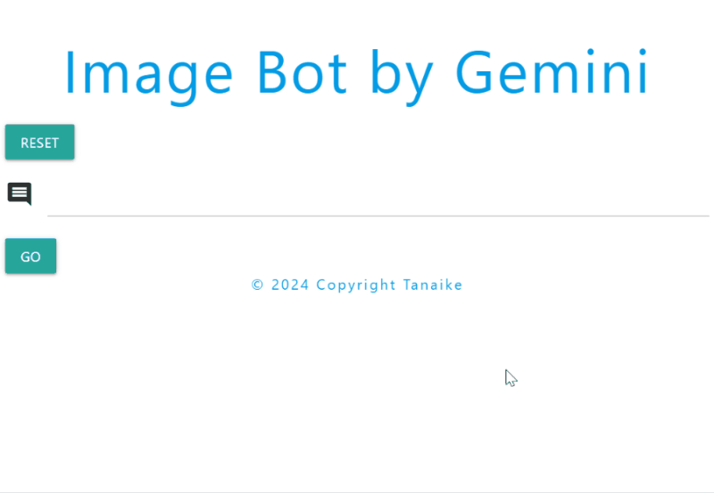
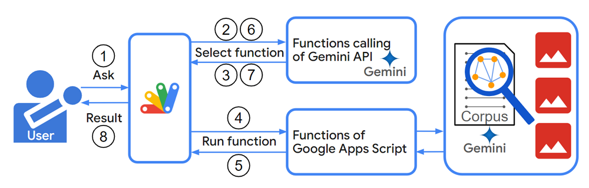

# ImageBotApp

<a name="top"></a>
[MIT License](LICENCE)

<a name="overview"></a>

# Overview



This is the image bot using Gemini with Google Apps Script and Google Drive.

<a name="description"></a>

# Description

The recent release of Gemini as an accessible API on Vertex AI and Google AI Studio empowers developers to integrate its vast capabilities into their applications, potentially revolutionizing fields like education, healthcare, and business. Adding even more powerful features with the recently announced Gemini 1.5, this tool promises even greater impact. [Ref](https://deepmind.google/technologies/gemini/#introduction) and [Ref](https://blog.google/technology/ai/google-gemini-next-generation-model-february-2024/) I believe Gemini significantly expands the potential for diverse applications across various fields. To showcase its potential, this report introduces an image bot using Gemini with Google Apps Script and Google Drive. This is just one example of the many compelling use cases developers can build with Gemini.


# Principle



This image illustrates the workflow of this image bot.

As the prerequisites, it supposes that some images are put into a folder of your Google Drive, and the descriptions of each image have been put into a corpus.

1. User gives a question.
2. Google Apps Script sends a request to the Gemini API.
3. The Gemini API identifies a suitable function with the arguments within the Google Apps Script project.
4. Google Apps Script executes the chosen function with the given arguments. And, Google Apps Script analyzes the corpus of image descriptions using semantic search to find relevant images.
5. The function running in Google Apps Script returns a response value.
6. Google Apps Script transmits the response value back to the Gemini API.
7. Google Apps Script merges the function's response with Gemini's insights, generating a comprehensive answer.
8. The final response is delivered back to the user through the image bot interface.

As additional information, this image bot application leverages function calling with Gemini to analyze and process images efficiently. As outlined in my previous report "Guide to Function Calling with Gemini and Google Apps Script: https://medium.com/google-cloud/guide-to-function-calling-with-gemini-and-google-apps-script-0e058d472f45", this approach allows seamless integration of Gemini's capabilities within the Google Apps Script environment, enabling powerful image processing functionality.

<a name="usage"></a>

# Usage

## 1. Install library

I'm concerned that the Google Apps Script project in this case might be a bit complex. To simplify testing, I've prepared it as a Google Apps Script library. You can use it directly within your own project or copy and paste the scripts into your Google Apps Script project if you prefer not to use the library.

Here's how to use the sample as a library. Install the library using the following steps.

1. Create a GAS project.

   - You can use this library for the GAS project of both the standalone and container-bound script types.

2. [Install this library](https://developers.google.com/apps-script/guides/libraries).

   - Library's project key is **`1qdq-ey6H3-HkG0AF4Tp4ZVEAUx-YryHXB5ZPW7oE-BeXN-wH2-b1PT_Q`**.

## 2. Linking Google Cloud Platform Project to Google Apps Script Project for New IDE

In this case, you can see how to do this at [my repository](https://github.com/tanaikech/Linking-Google-Cloud-Platform-Project-to-Google-Apps-Script-Project-for-New-IDE).

Also, please enable Generative Language API at the API console.

After the above setting, the following sample script can be used.

## 3. Scopes

This library uses the following 2 scopes.

- `https://www.googleapis.com/auth/script.external_request`
- `https://www.googleapis.com/auth/generative-language.retriever`
- `https://www.googleapis.com/auth/drive`

When this library is installed, the above scopes are automatically installed to your Google Apps Script project.

## 5. Prepare a folder
Please create a new folder in your Google Drive.

If you have already had some images, please put them into this folder.

## 4. Script

Please copy and paste the following script to the script editor of your Google Apps Script project. And, please set the folder ID of your created folder to `folderId` in the function `init_`.

```javascript
function init_() {
  // Please set the folder ID of the folder including images.
  const folderId = "###";

  const newCorpusName = { name: "corpora/sample-corpus-1", displayName: "sample corpus 1" };
  const newDocumentName = { name: `${newCorpusName.name}/documents/sample-document-1`, displayName: "sample document 1" };
  return { folderId, newCorpusName, newDocumentName };
}

// This is a main function. This is used from the library.
const doGet = e => ImageBotApp.main({ ...e, ...init_() });

// This is used for putting the existing images in the folder to the corpus.
function putImageDescriptionsToCorpus() {
  const res = ImageBotApp.putImageDescriptionsToCorpus(init_());
  console.log(JSON.stringify(res.map(r => JSON.parse(r.getContentText()))));
}
```

## 5. Deploy Web Apps

This library is used with Web Apps. So, please deploy Web Apps as follows. The detailed information can be seen in [the official document](https://developers.google.com/apps-script/guides/web#deploy_a_script_as_a_web_app).

Please set this using the script editor of your Google Apps Script project.

1. On the script editor, at the top right of the script editor, please click "click Deploy" -> "New deployment".
2. Please click "Select type" -> "Web App".
3. Please input the information about the Web App in the fields under "Deployment configuration".
4. Please select **"Me"** for **"Execute as"**.
5. Please select **"Anyone"** for **"Who has access to the app:"**.
6. Please click "Deploy" button.
7. On the script editor, at the top right of the script editor, please click "click Deploy" -> "Test deployments".
8. Copy Web Apps URL. It's like `https://script.google.com/macros/s/###/exec`.

- **When you modify the Google Apps Script of Web Apps, please modify the deployment as a new version. By this, the modified script is reflected in Web Apps. Please be careful about this.**

- You can see the details of this in my report "[Redeploying Web Apps without Changing URL of Web Apps for new IDE](https://gist.github.com/tanaikech/ebf92d8f427d02d53989d6c3464a9c43)".

## 6. Testing

Before proceeding, if your folder contains images, please run the `putImageDescriptionsToCorpus` function. This generates descriptions for your images and adds them to the corpus.

To use this library:

- Open the Web Apps URL in your browser. You'll see a demonstration image at the top of the page, just like in this post.

Currently, you can search for and upload images as a sample.

# Note
- This is a simple application using Gemini. However, I believe that it will help users understanding Gemini.

---

<a name="licence"></a>

# Licence

[MIT](LICENCE)

<a name="author"></a>

# Author

[Tanaike](https://tanaikech.github.io/about/)

[Donate](https://tanaikech.github.io/donate/)

<a name="updatehistory"></a>

# Update History

- v1.0.0 (February 22, 2024)

  1. Initial release.

[TOP](#top)

